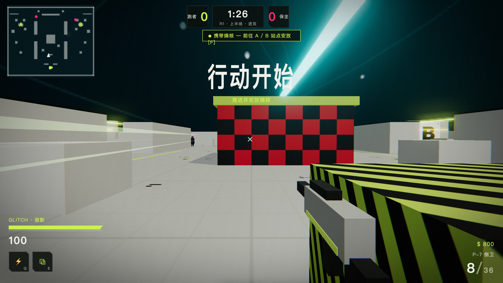
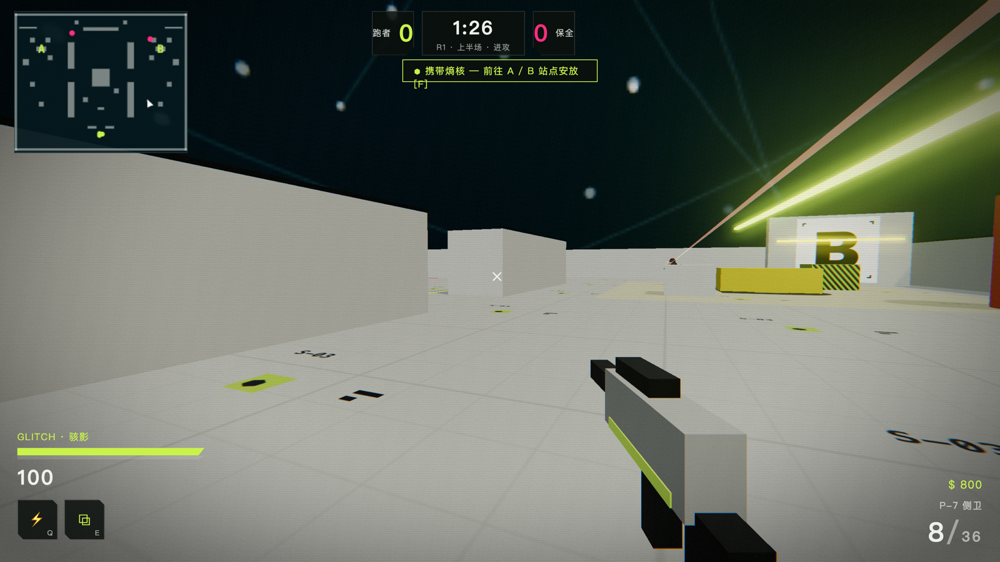
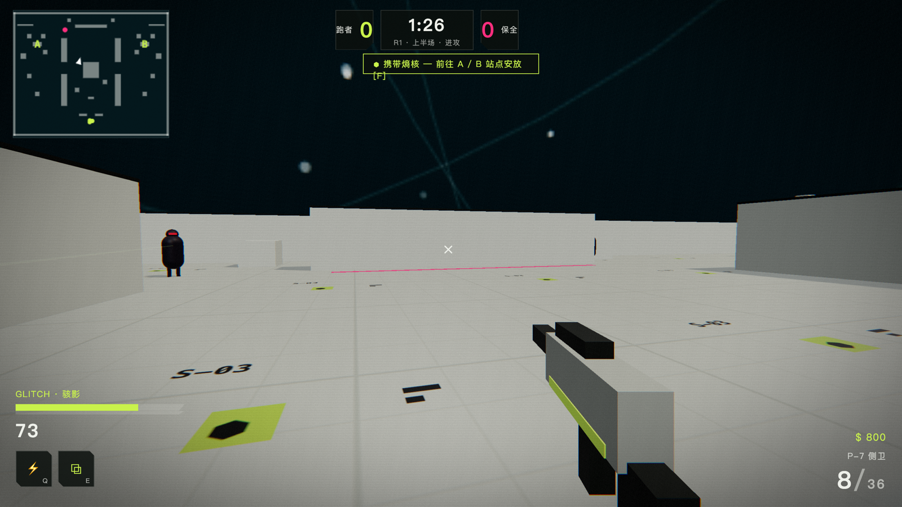

# MARATHON: Lost Starship — Entropy Core Op


[简体中文](README.md) · **English**

> An unofficial fan homage: a browser FPS blending **Marathon aesthetics × Valorant gameplay**.

## Overview

A 5v5 search-and-destroy match aboard a lost starship. Attackers plant the "Entropy Core" at site A / B; defenders stop them or defuse. First to **13 rounds** wins; sides swap after 12, and 12-12 goes to a decider.

- **Gameplay**: 5v5 search & destroy (plant / defuse the Entropy Core).
- **Hero abilities**: 4 Runners, each with a Q / E ability.
- **Economy**: kill +$200, plant +$300, round win +$3000, round loss +$1900; press **B** during the buy phase to purchase weapons and armor.
- **Allies & enemies**: AI bots (pathfinding, engaging, planting, defusing, holding sites).

## Screenshots

> Procedurally generated 3D scenes · acid-neon-green HUD · red-black checkerboard sites · safety-yellow hazard stripes · deep-cyan void starfield.







## Run

```bash
npm install
npm run dev        # http://localhost:5190
npm run build      # output in dist/, deploy as static files
npm run dist        # package Mac / Win desktop installers (Electron)
```

## Controls

| Key | Action |
| --- | --- |
| WASD / Space / C / Shift | Move / Jump / Crouch / Walk |
| Mouse L / R | Fire / Aim (sniper scope) |
| Q / E | Hero abilities |
| B | Buy menu (buy phase only) |
| F (hold) | Plant / Defuse the Entropy Core |
| R · 1/2/3 | Reload · Primary / Pistol / Melee |

## Runners

| Runner | Q | E |
| --- | --- | --- |
| GLITCH | Phase Dash | Afterimage Decoy (draws AI fire) |
| LOCUS | Kinetic Barrier (blocks bullets) | Overload Armor (+50 armor) |
| BLACKBIRD | Sonar Pulse (see-through for 4s) | Hunt Mark (marks nearest enemy for 8s) |
| VOID | Void Smoke (blocks AI line of sight) | Phase Cloak (broken on firing) |

## Aesthetic Sources

The visual DNA is drawn from publicly available Marathon official art references (acidic neon-green wordmarks, white platforms with safety-yellow / warning-orange blocks, black super-graphic lettering, red-black checkerboards, deep-cyan void starfields). All 3D assets are procedurally generated; the fonts are open source (Orbitron / Chakra Petch / Archivo Black, from Google Fonts). **No Bungie copyrighted assets are used.**

## Tech

Vite + Three.js, with no other runtime dependencies. All audio is procedurally synthesized with WebAudio. AI uses A\* waypoint-graph navigation plus pure-math line-of-sight checks (accounting for smoke / barrier occlusion).

## Roadmap (not yet built)

- Real multiplayer (needs a WebSocket/WebRTC server for state sync)
- Ultimates and more Runners
- Higher-fidelity character / weapon models (swappable glTF assets)
- Overtime rules, end-of-round slow-motion replays

## Copyright Notice

This is a non-commercial fan homage, not affiliated with or endorsed by Bungie or Riot Games. "Marathon" and "Valorant" are trademarks of their respective owners. This repository contains no official copyrighted assets.
